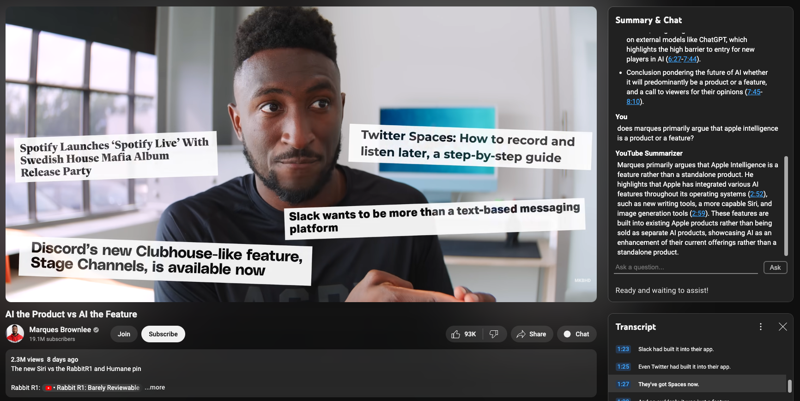

# YouTube Summarizer

## Overview

YouTube Summarizer is a Chrome extension that summarizes YouTube videos and allows you to ask follow-up questions about them.

I find that informative YouTube videos can oftentimes be compressed into a much briefer summary. In an attempt to decrease the time spent watching these videos, I created this extension.

When clicking the "Chat" button, it feeds the video's transcript to GPT-4o and returns a summary. Its context also includes timestamps, so you can more quickly find a spot in the video you're watching by simply asking.

## Installation

I haven't (yet) added this extension to the Chrome Web Store. You can still use it by loading the unpacked extension.

1. Clone the repository OR download the ZIP and extract it
2. Follow the instructions on [Google's docs](https://developer.chrome.com/docs/extensions/get-started/tutorial/hello-world#load-unpacked) for loading an unpacked extension (using the directory obtained above)
3. Add your OpenAI API key within the extension's options
4. Summarize away!
